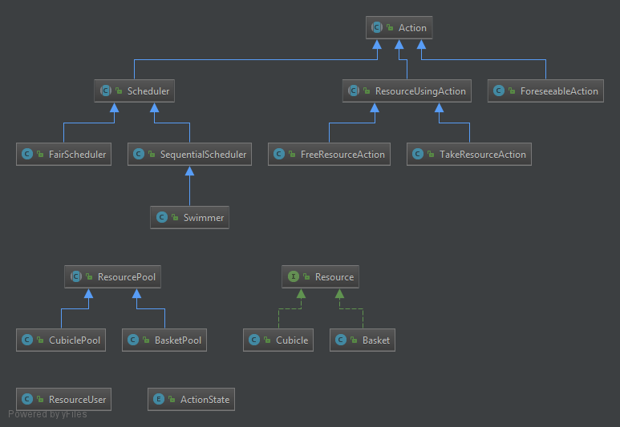

Bienvenue sur notre TP Quiz
===================

----------

Mini projet réalisé dans le cadre de la Conception Orienté Objet par Christopher Caroni et Leprêtre Guillaume. Ce projet sera évalué par notre professeur de TD Quentin Baert. Dans ce tp, vous pouvez répondre à un questionnaire en mode texte ou graphique

# Composition du TP :

- Le code source dans `src/main`
- Les tests unitaire dans `src/test`
- Les différents UML dans `/diagrams`. Attention: tous les diagrammes ne sont pas présentés dans ce readme,
  et certains diagrammes peuvent "cacher" des classes car elles ne présentent qu'une petite de ces vue.
- Le `README.md` de ce tp

# Composition du TP :

- Le code source dans `src/main`
- Les fichiers texte quiz dans `/resources`
- Les tests unitaire dans `src/test`
- Les différents UML dans `/diagrams`. Attention: tous les diagrammes ne sont pas présentés dans ce readme,
  et certains diagrammes peuvent "cacher" des classes car elles ne présentent qu'une petite de ces vue.
- Le `README.md` de ce tp

# Mise en place du TP :

- Télécharger l'archive à l'aide de la commande `git clone`
-  Compiler avec la commande `mvn package`
- Vous pouvez générer la javadoc avec la commande `mvn javadoc:javadoc`
- Pour lancer le programme, exécuter la commande  `java -jar COO-Quiz-1.0-SNAPSHOT.jar` dans le dossier `target`

# Diposition des classes :

Si vous voulez voir des détails spécifique sur nos UML, dirigez vous dans le dossier `/diagrams` où vous trouverez des UML pour les différents package.

Vous pouvez voir ci-dessous l'UML complet de notre projet :

# Tests :

Lors de la réalisation de notre tp, nous avons continuer de déveloper en `TDD` (Test Driven Developement), en particulier pour les classes `Answer` où nous avons pu régler de nombreux problème lors du dévelopement de ce projet. 
Par le biais du fichier `.gitlab-ci.yml`, nous pouvons executer les tests de notre projet avec Maven, directement sur git.

Ainsi, vous pouvez voir ci-dessous que les tests exécutés sont correcte :

Master branch:

Vous pouvez voir ci-dessous l'UML des différents test: 

## MVC

Pour la réalisation graphique nous avons décider de créer une architecture `MVC` (Modele View Controller). Le but est de séparer le projet en 3 étapes :

- Le `modèle` qui est le corps de notre projet où toutes `les données` sont manipulés et stockées
- La `vue` représente le `modele graphique.` C'est ce que l'utilisateur va voir et où il va pouvoir intéragir avec notre quiz.
- Le `controlleur` va récupérer les données et les transférer directement à la vue. 

L'utilisation de cet architecture permet d'avoir une conception claire et efficace, un gain de temps en terme d'évolution et maintenance du projet ainsi qu'une plus grande souplesse entre les développeurs d'une équipe en terme de partage de tâche. 

Vous pouvez voir ci-dessous les classes présentes dans notre mvc ci-dessous :

