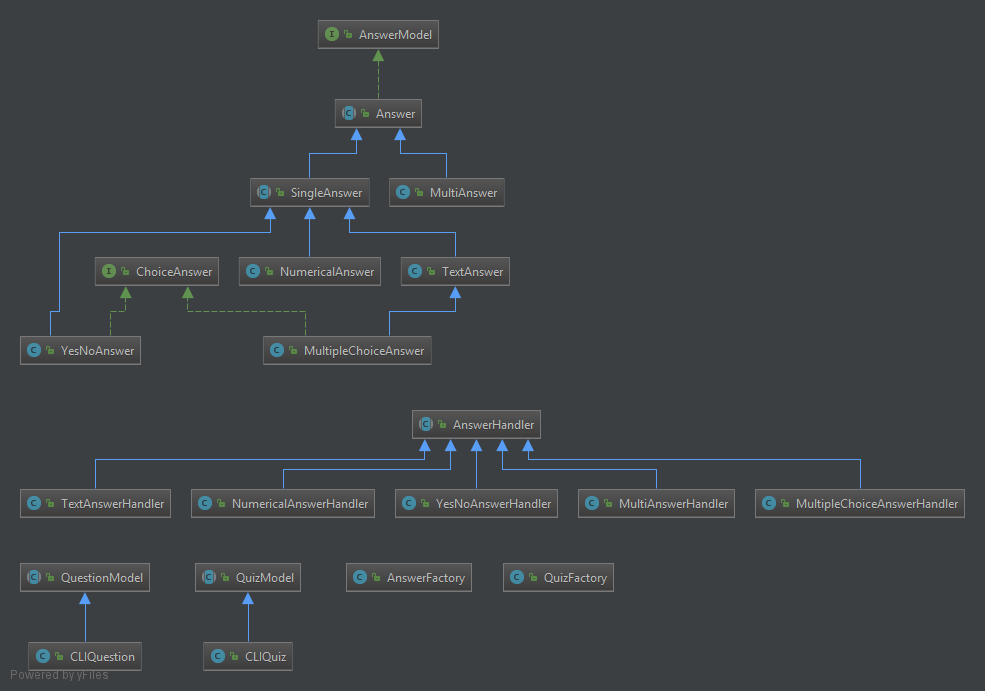
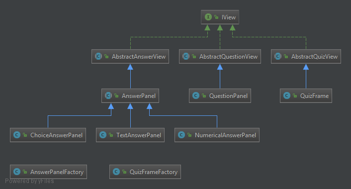
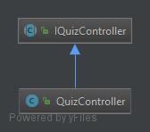
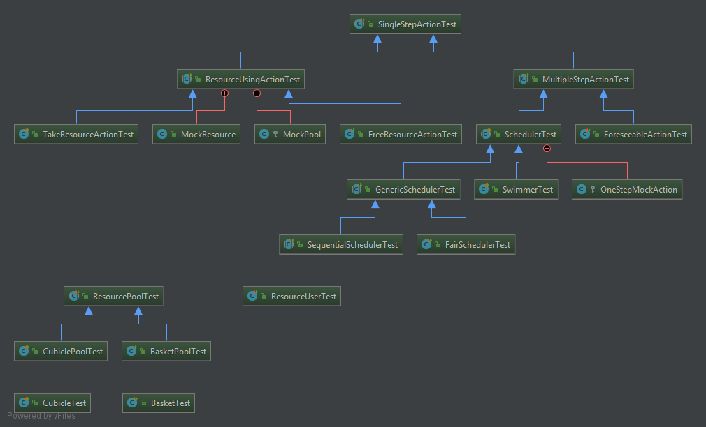
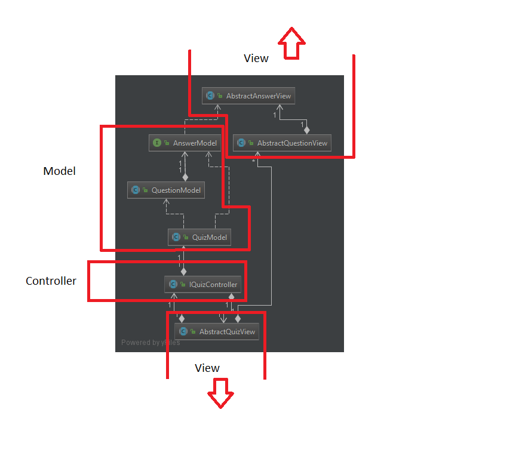

<<<<<<< HEAD
Bienvenue sur notre TP Piscine
=======
Bienvenue sur notre TP Quiz
>>>>>>> older_COO-QUIZ/master
===================

----------
<<<<<<< HEAD

Mini projet réalisé dans le cadre de la Conception Orienté Objet par Christopher Caroni et Leprêtre Guillaume. Ce projet sera évalué par notre professeur de TD Quentin Baert. Dans ce tp, vous pouvez gérer une piscine...

# Composition du TP :

- Une archive `Maven`
- Le code source dans `src/main`
- Les tests unitaire dans `src/test`
=======

Mini projet réalisé dans le cadre de la Conception Orienté Objet par Christopher Caroni et Leprêtre Guillaume. Ce projet sera évalué par notre professeur de TD Quentin Baert. Dans ce tp, vous pouvez répondre à un questionnaire en mode texte ou graphique

# Composition du TP :

- Le code source dans `src/main`
- Les tests unitaire dans `src/test`
- Les différents UML dans `/diagrams`. Attention: tous les diagrammes ne sont pas présentés dans ce readme car elles n'apportent pas forcément
plus d'aide à la compréhension de l'architecture du projet.
- Le `README.md` de ce tp

# Composition du TP :

- Le code source dans `src/main`
- Les fichiers texte quiz dans `/resources`
- Les tests unitaire dans `src/test`
>>>>>>> older_COO-QUIZ/master
- Les différents UML dans `/diagrams`. Attention: tous les diagrammes ne sont pas présentés dans ce readme,
  et certains diagrammes peuvent "cacher" des classes car elles ne présentent qu'une petite de ces vue.
- Le `README.md` de ce tp

<<<<<<< HEAD
# Mise en place du tp:

- Télécharger l'archive à l'aide de la commande `git clone`
-  Compiler avec la commande `mvn package`
- Vous pouvez générer la javadoc avec la commande `mvn javadoc:javadoc`
- Pour lancer le programme, exécuter la commande  `java -jar COO-Pool-1.0-SNAPSHOT.jar` dans le dossier `target`

# Diposition des classes :

Si vous voulez voir des détails spécifique sur nos UML, dirigez vous dans le dossier `/diagrams` où vous trouverez des UML pour les différents package.

Vous pouvez voir ci-dessous l'UML complet de notre projet :

=======
# Mise en place du TP :

- Télécharger l'archive à l'aide de la commande `git clone`
-  Compiler avec la commande `mvn package` ou `mvn clean install`
- Vous pouvez générer la javadoc avec la commande `mvn javadoc:javadoc`
- Pour lancer le programme, exécuter la commande  `java -jar COO-QUIZ-VERSION.jar <quiz_file> [-t | d]` dans le dossier `target` avec les arguments adéquat
- Pour voir les utilisations des arguments faites `java -jar COO-QUIZ-VERSION.jar -h`

# Diposition des classes :

L'architecture principale de ce projet se définit grâce à la structure MVC qui est présentée ci dessous:
## Les modèles

## Les vues

## Le controlleur

>>>>>>> older_COO-QUIZ/master

# Tests :

<<<<<<< HEAD
Lors de la réalisation de notre tp, nous avons déveloper en `TDD` (Test Driven Developement) où le but est de coder les tests avant de coder les différentes méthodes.
Cette méthode est souvent utilisé dans les entreprises et à l'avantage de ne jamais être surpris d'un `bug`. En effet, le but est de réalisé les tests et le code pas à pas
et de vérifier le tout en executant ces tests. Par conséquent, si le test ne fonctionne pas, le problème viens soit de la `méthode/classe` crée, soit du `test` lui même.
=======
Lors de la réalisation de notre tp, nous avons continuer de déveloper en `TDD` (Test Driven Developement), en particulier pour les classes `Answer` où nous avons pu régler de nombreux problème lors du dévelopement de ce projet. 
>>>>>>> older_COO-QUIZ/master
Par le biais du fichier `.gitlab-ci.yml`, nous pouvons executer les tests de notre projet avec Maven, directement sur git.

Ainsi, vous pouvez voir ci-dessous que les tests exécutés sont correcte :

Master branch:

Vous pouvez voir ci-dessous l'UML des différents test: 

<<<<<<< HEAD
# Précision de code :

## Logger

- Le Logger est une classe permettant d'avoir des traces d'exécutions
- Il peut remplacer le `System.out.println("String")`, en utilisant `Logger.info("String")`
- Il permet de  `configurer` les traces d'exécutions, par exemple en produisant le texte à la fois sur la sortie standard et dans un fichier `.log`
- Ainsi, dans `/src/main/resources` et `/src/test/resources` nous avons des fichier de configuration spécifiques à l'éxécution pour le logger utilisé par ce projet.
- Grâce à cela, il n'y a aucune trace à l'écran lors de la phase `exécution des tests` avec Maven
- Tout est redirigé vers un fichier `.log` dans le dossier `logs/test/DATE.log`

## SwimmerTest

Cette classe permet de tester la classe `Swimmer` qui étend la classe `SequentialScheduler`, lui-même testé par `SequentialSchedulerTest`.
On pourrait s'attendre à ce que l'on teste `Swimmer` en héritant de la classe `SequentialScheduler` mais comme Swimmer est une classe concrète qui possède une éxécution
spécifique, il agit différemment de SequentialScheduler et ainsi doit être testé d'une manière différente. Ceci est parce qu'un Swimmer possède un nombre et des actions
prédéfinies lors de sa construction, actions qui définissement `Swimmer`. Il serait alors inutile de tester Swimmer avec les tests de SequentialSchedulerTest car il faudrait alors
tester une version simplifiée, ce qui reviendrait à tester SequentialScheduler.  
La solution est une classe de teste commune à SequentialSchedulerTest et SwimmerTest: `GenericSchedulerTest`.

=======
## MVC

Pour la réalisation graphique nous avons décider de créer une architecture `MVC` (Model View Controller). Le but est de séparer le projet en 3 parties :

- Le `modèle` qui est le corps des `données` où elles sont sont manipulés et stockées
- La `vue` représente le `modele graphique.` C'est ce que l'utilisateur va voir et où il va pouvoir intéragir avec notre quiz.
- Le `controlleur` va reçoit des évenements de la vue, récupère les données de l'utilisateur et les vérifies contre les données du modèle. Ensuite, il peut notifier la vue du résultat.

Ainsi, la vue est complètement indépendante du modèle et vice versa. Seul le controlleur dépend de ces deux, mais il s'agit de vérifier l'utilisation de classes abstraites ou d'interfaces
afin de limiter le plus possible les dépendances à une conception spécifique.

L'utilisation de cet architecture permet d'avoir une conception claire et efficace, un gain de temps en terme d'évolution et maintenance du projet ainsi qu'une plus grande souplesse entre les développeurs d'une équipe en terme de partage de tâches. 

Vous pouvez voir ci-dessous les classes présentes dans notre mvc ci-dessous :

Dans cet uml, on affiche aussi les dépendances entres les différentes classes. On voit que le modèle et bien indépendant des vues, sauf pour une petite dépendance entre
`AnswerModel` et `AbstractAnswerView`. Ceci est parce que l'on a besoin de créer une vue spécifique selon la type de réponse qu'on attend de l'utilisateur.  
Ceci viole en quelque sorte le principe OCP mais on a limitée les dépendances à un stricte minimum. On utilise le `double dispatch` pour savoir quelle classe de vue
il faut créer pour un modèle spécifique. Après, dans notre `AnswerPanelFactory`, la classe qui gère la construction de ces vues, nous utilisons que les méthodes abstraites
ou des interfaces des super-classes ces réponses pour accéder aux données. La seule dépendance est donc en réalité à cause du double dispatch et nos vues ne dépendent donc pas vraiement de nos modèles.
>>>>>>> older_COO-QUIZ/master
